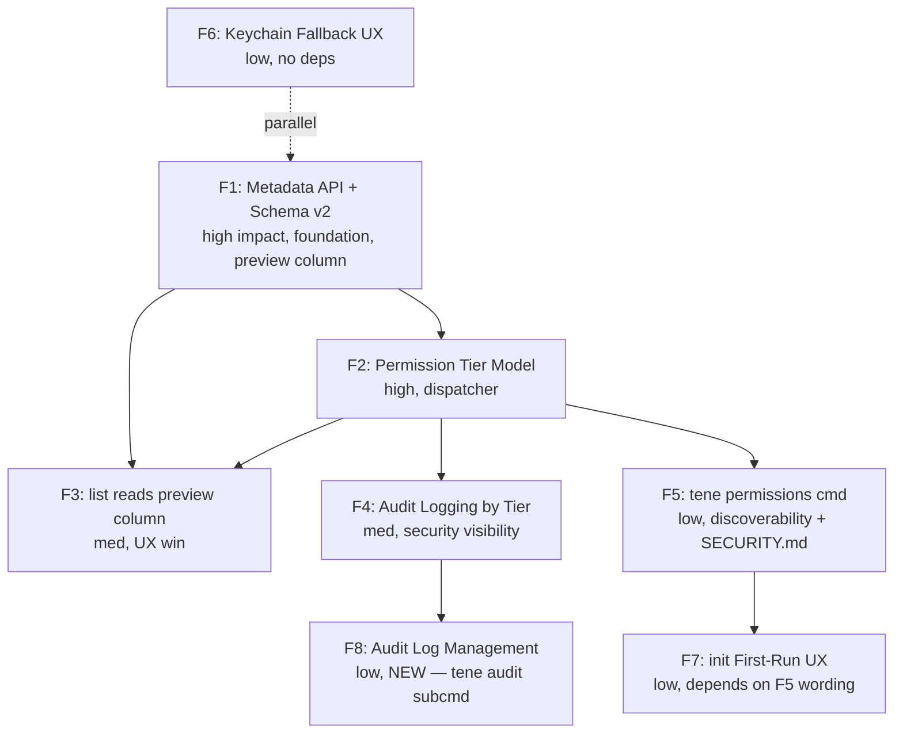

# tene CLI UX & AI-Safe Permission Model — Sprint Master Plan

> **Sprint ID**: `cli-ux-permission-model`
> **Working branch**: `feature/cli-ux-permission-model`
> **Trust Level**: L3 (auto plan→report, manual archive)
> **Duration estimate**: ~3 weeks (3 PDCA-eligible chunks)
> **Status**: Draft v1.0 — pending review

---

## §0 Executive Summary

### Mission

CLI 명령을 **권한 등급(permission tier)** 으로 명시적으로 분류하고, 가장 약한 등급(metadata read)은 master password / keychain unlock 없이 즉시 응답한다. 가장 강한 등급(plaintext read)은 기존 정책(STDOUT_SECRET_BLOCKED + --unsafe-stdout opt-in)을 통합·강화한다. 결과: indie hacker 가 AI 보조 코딩 세션에서 password fatigue 없이 vault 를 탐색하면서도 secret value 는 명시적 opt-in 없이는 절대 새지 않는다.

### Anti-Mission (이 sprint 가 해서는 안 되는 것)

- 새로운 암호화 알고리즘 도입 (XChaCha20-Poly1305 + Argon2id 유지)
- vault DB schema 의 `encrypted_value` 컬럼 평문화 (절대 불가)
- recovery key / mnemonic 메커니즘 약화
- 외부 네트워크 호출 추가 (zero-server 원칙)
- AI 가 default 로 secret value 를 stdout 으로 받는 동작 도입
- tene-cloud 서버 / Dashboard 변경

### 4-Perspective Value

| 관점 | 가치 |
|------|------|
| **User (indie hacker)** | "내가 가진 키 이름만 빠르게 보고 싶다"가 password 없이 즉답으로 해결. 30분 세션당 prompt 횟수 60% 감소(가설). `tene init` 직후 keychain 자동 캐싱 동작은 그대로 유지. |
| **AI assistant (Claude/Cursor)** | `tene list --json` 을 안전하게 호출해서 어떤 키가 있는지 학습할 수 있다 (이름만, 값은 못 봄). `tene get --json` 은 여전히 STDOUT_SECRET_BLOCKED 로 막힘 — 변화 없음. |
| **Security reviewer** | Permission tier 가 코드에 명시 선언되어 (`PermLevel` enum) audit 가 쉽다. `tene` 호출 1회당 어느 tier 가 활성화됐는지 audit_log 에 기록. |
| **Project owner (kay)** | Breaking change 0건 (모든 기존 워크플로 호환). 새 capability 만 추가. `tene list` 가 password 없이 동작하는 것은 능력 확장이지 약화 아님. |

---

## §1 Context Anchor

### WHY (5 W's compressed)

기존: `tene list` 등 metadata-tier 명령이 password 를 요구하는 이유는 **value preview** 를 보여주기 위함 (`sk_t****x`). preview 기능 자체는 nice-to-have 인데, 그 한 줄을 위해 매 호출마다 keychain unlock (혹은 password prompt) 비용을 치르고 있다.

코드베이스 분석 결과 결정적 사실:
1. **secrets.name 컬럼은 평문** (`internal/vault/schema.go:11`). preview 만 포기하면 list 는 unlock 불필요.
2. **keychain 은 이미 cross-platform** (macOS Keychain / Linux libsecret / Windows CredManager via `go-keyring`). `init` 직후 master key 가 자동 캐싱돼서 동일 머신에서는 password prompt 가 안 뜬다. 사용자가 password 를 자주 본다는 인식은 `--no-keychain` 또는 keychain 손상 케이스에서 발생.
3. **STDOUT_SECRET_BLOCKED 정책이 이미 구현** (`internal/cli/get.go:101`). AI escape hatch (`--unsafe-stdout`, `TENE_ALLOW_STDOUT_SECRETS=1`) 도 이미 있음. F5(가설)는 새로 만드는 게 아니라 **통합·문서화·다른 명령으로 확장** 작업.
4. **`pkg/domain/vault_key_metadata.go` 의 `VaultKeyMeta` 타입이 이미 존재** — 원래 cloud push 용. 같은 타입을 metadata-tier 응답 모델로 재사용 가능.
5. **`set`/`import` 는 unlock 필수** — 새 값을 encKey 로 암호화해야 하므로. 회피 불가. 다만 keychain 캐싱이 잘 되어 있어서 동일 머신에서는 prompt 가 안 뜬다.

### WHO

- **Primary**: AI 보조로 개발하는 indie hacker / solo founder. tene 핵심 페르소나. Claude Code / Cursor / Windsurf 에서 매일 `tene list` / `tene set` 호출.
- **Secondary**: CI/CD pipeline 에서 `--no-keychain` 으로 tene 를 호출하는 백엔드 엔지니어. password 를 매번 stdin 으로 흘려넣는 친구.
- **Tertiary**: tene 를 처음 접한 개발자 — `tene init` 첫 60초 안에 vault 가 어떻게 동작하는지 이해해야 함.

### RISK

| 카테고리 | 위험 | 완화 |
|---------|------|------|
| **보안 invariant — preview 평문 컬럼 (Q2 결정, 2026-05-20 default 강화)** | vault.db 가 외부로 유출되면 secret 의 뒤 4 글자가 평문 노출 (예: `…aBc1`). **default 는 뒤 4 글자만** — API key prefix (`sk-` Stripe/OpenAI, `ghp_` GitHub, `AKIA` AWS) 식별 정보는 노출 안 됨. 사용자가 명시적으로 `preview.front>0` 설정 시에만 prefix 가 추가 노출 (UX 강화 opt-in). | (1) **default: `preview.front=0, preview.back=4`** — prefix 노출 차단이 기본. (2) vault.db 파일 권한 0600 강제. (3) `tene config preview.enabled=false` 로 즉시 비활성. (4) `preview.front=N` 으로 사용자가 의도적으로 prefix 일부 노출 가능 (max front+back ≤ 8). (5) SECURITY.md + README + design.md 에 threat model 명문화 — "기본은 service identification 차단, 사용자 opt-in 시 trade-off 동의" |
| **보안 invariant — secret VALUE 자체** | metadata read path 를 만들면서 실수로 ciphertext column 도 평문 노출 | 새 API 는 `name, version, updated_at, preview` 4컬럼만 SELECT. `encrypted_value` 절대 평문화 금지 — invariant 유지 |
| **회귀** | `tene list` 의 JSON shape 변경 → 사용자 스크립트 깨짐 | Q2 결정으로 `preview` 가 항상 string (또는 빈 문자열 if disabled). JSON consumer 가 null check 불요 — 오히려 단순화 |
| **회귀 — schema migration** | vault.db schema v1 → v2 변경, 기존 사용자 vault 가 손상되거나 preview 가 비어있는 채로 남음 | (1) `migrate()` 함수가 idempotent. (2) v1 vault 열 때 `ALTER TABLE secrets ADD COLUMN preview TEXT DEFAULT ''` 자동 실행. (3) 기존 secret 의 preview 는 `tene migrate fill-previews` 또는 다음 `tene unlock`/`set` 시점에 lazy 채움. (4) preview 비어있어도 list 정상 동작 (빈 문자열 표시). (5) rollback path 문서화 |
| **Cross-repo — schema 변동** | sync protocol 이 vault schema 의존 시 tene-cloud 빌드/runtime 회귀 | (1) F1 시작 전 `grep -rn "encrypted_value\|secrets table" tene-cloud/` 로 사용처 전수. (2) `pkg/domain.VaultKeyMeta` 에 `Preview string` 필드 additive 추가 (cloud push payload 에 자연스럽게 흘러감 — 그러나 cloud server 가 preview 를 저장할지는 별도 결정. 기본은 server 가 ignore). (3) tene-cloud 양쪽 빌드 G3 통과 필수 |
| **UX 혼란** | 일부 명령은 password 묻고, 일부는 안 묻는 것이 일관성 없어 보임 | help text + `tene` 메인 화면에 permission tier 표 노출. `tene permissions` 메타 명령 (F5) 추가 |
| **Keychain 손상** | macOS Login 키체인 잠금 / Linux libsecret 미설치 환경에서 unlock 캐시 못 함 | 이미 file-keystore fallback 존재. 추가 작업 불요. 다만 fallback 발동 시 stderr 에 일회성 안내 출력 (F6) |
| **`--allow-read` 오용** | 사용자가 무심코 alias 로 박아두고 잊음 | 새 flag 도입 안 함. 기존 `--unsafe-stdout` 만 유지·문서화. shell history 에 남는 점이 자연 deterrent |
| **Audit log 비대화** | 모든 CLI 호출 → 1 row, 장기 운영 시 vault.db 비대 | F8 (audit log management) 신규 추가. 50MB 임계값 도달 시 stderr 1회 경고 + `tene audit prune --older-than 30d` 권고. 자동 삭제 절대 금지 (forensic) |

### SUCCESS

| 지표 | Baseline (현재) | Target (sprint 후) | 측정 방법 |
|------|-----------------|-------------------|----------|
| `tene list` 명령 password prompt 발생률 (keychain unavailable 시) | 100% | 0% (no decrypt mode) | 통합 테스트 + 수동 ad-hoc |
| `tene list` 명령 평균 응답 시간 (decrypt skip 시) | ~80ms (Argon2id derive + AES open) | <15ms | go test -bench |
| 매 명령마다 어떤 permission tier 가 발동했는지 audit_log 에 기록 | 0% (기록 안 함) | 100% | DB inspection |
| Permission tier 자체가 코드에 enum 으로 선언 | 0건 | 1건 (`internal/auth.PermLevel`) | grep |
| breaking change | (기준점) | 0건 | CHANGELOG diff + integration suite |
| tene-cloud `go build ./...` 회귀 | 0건 | 0건 | cross-repo CI |
| Lighthouse-style metric: "password prompts per 30-min vibe coding session" | 가설 5회 | 가설 1-2회 | 사용자 1주 운영 후 self-report |

### SCOPE

**IN**:
- `internal/cli/root.go` — permission tier 선언 + dispatcher + audit threshold 경고 hook
- `internal/cli/list.go` — preview 평문 컬럼 직접 읽어 표시 (unlock 불요)
- `internal/cli/env.go` — 변경 없음 (이미 password-free) 다만 audit 기록 추가
- `internal/cli/get.go`, `export.go`, `run.go` — 변경 없음 (값 정책 그대로). audit 기록 강화
- 새 패키지 `internal/auth/` — `PermLevel` enum + tier 정책 declarative table
- 새 패키지 `internal/audit/` — log manager (rotate, filter, prune, threshold) [F8]
- 새 패키지 `internal/config/` 확장 — preview.* / audit.* config 키
- `internal/vault/vault.go` — `ListSecretMetadata(env)` 추가, schema v1→v2 migration (preview 컬럼)
- `internal/vault/schema.go` — schema v2 + migration SQL
- `pkg/domain/vault_key_metadata.go` — `Preview string` 필드 additive 추가
- `pkg/crypto/preview.go` (new) — `DerivePreview(plaintext, front, back) string` 헬퍼
- `tene init` 후 출력 메시지 — permission tier 모델 + preview 동작 1줄 소개
- 새 명령 `tene permissions` (F5)
- 새 명령 `tene audit tail/show/prune` (F8)
- 새 명령 `tene migrate` (or 자동) — 기존 secret 의 preview 채우기
- 새 명령 `tene config <key>=<value>` — preview/audit 설정
- README + `CHANGELOG.md` + `SECURITY.md` 업데이트 (preview trade-off 명문화)
- help text: `tene --help` 끝에 permission tier 표

**OUT**:
- tene-cloud API server 변경
- Dashboard UI 변경
- Sync protocol 변경 (push/pull/sync 명령은 cloud 비활성 상태로 그대로 둠 — 다만 `pkg/domain` 의 `VaultKeyMeta.Preview` 필드는 cloud payload 에 자동 흘러감)
- 새 암호화 알고리즘 / KDF 파라미터 조정
- `set`/`import` 의 unlock 요구 우회 (기술적으로 무리, scope 외)
- iOS/Android 앱 (없음)
- bash/zsh completion 갱신 (필요하면 별도 sprint)
- audit log 자동 삭제/rotation (forensic 데이터 임의 손실 위험 — 권고만)

### OUT-OF-SCOPE (명시적 거부)

- ❌ "default 로 AI 가 secret value 보게 하자" — 절대 불가
- ❌ "`tene get` 의 STDOUT_SECRET_BLOCKED 끄자" — 정책 약화
- ❌ "`set` 도 password 없이 되게 하자" — encKey 없이는 암호화 불가, 회피 불가
- ❌ "새 `--allow-read` 플래그 도입" — 기존 `--unsafe-stdout` 와 중복
- ❌ "permission tier 를 사용자가 config 로 바꾸게 하자" — 보안 정책은 코드 hardcode
- ❌ "preview 컬럼을 secret VALUE 전체로 확장" — 절대 금지. 길이 hard cap front+back ≤ 8 chars (default front 0 + back 4)

---

## §2 Features

| ID | Name | Security impact | Blocked by | PDCA 사이클 | Touchpoints |
|----|------|:---:|---|:---:|---|
| F1 | Vault Metadata Read API + Schema v2 Migration | **high** | — | 1 | `internal/vault/vault.go`, `internal/vault/schema.go`, `pkg/domain/vault_key_metadata.go`, `pkg/crypto/preview.go` (new), `internal/cli/migrate.go` (new), unit tests |
| F2 | Permission Tier Model (declarative) | **high** | F1 | 1 | new `internal/auth/`, `internal/cli/root.go` |
| F3 | `list` Reads Preview Column Directly | **med** | F1, F2 | 1 | `internal/cli/list.go`, integration + migration tests |
| F4 | Audit Logging by Permission Tier | **med** | F2 | 1 | `internal/cli/root.go` (pre-run hook), `internal/vault/vault.go` (AddAuditLog already exists) |
| F5 | `tene permissions` Info Command + Help Integration | **low** | F2 | 1 | new `internal/cli/permissions.go`, `internal/cli/root.go` Long text, `README.md`, `CHANGELOG.md`, `SECURITY.md` |
| F6 | Keychain Fallback UX Polish | **low** | — | 1 | `internal/cli/root.go` (one-time stderr notice), `internal/keychain/*.go` |
| F7 | `tene init` First-Run UX Update | **low** | F5 | 1 | `internal/cli/init.go` (output text + preview consent prompt) |
| **F8** | **Audit Log Management** | **low** | F4 | 1 | `internal/cli/audit.go` (new), `internal/audit/manager.go` (new), `internal/audit/manager_test.go` (new), `internal/cli/root.go` (threshold hook), `internal/config/` (audit.warnAtMB) |

**Total: 8 features**. LOC 합산표는 §6 참조 (총 ~2,413 LOC, tests 포함). 가장 큰 단위는 F1 (770 LOC — schema migration + preview derive + new domain field + tene config + tene migrate) 와 F8 (745 LOC — audit manager + 3 sub-commands + threshold hook). F2 는 255 LOC (declarative tier + dispatcher), F3 는 ~200 LOC (preview 컬럼 직접 read). F4/F5/F6/F7 은 소규모 (38-210 LOC 각).

---

## §3 Dependency Graph (Kahn topo sort 결과)

**Topo order (one valid sequence)**: F1 → F2 → F3, F4, F5 (parallel) → F8, F7. F6 anywhere.

---

## §4 Sprint Phase Roadmap (Week 단위 bin-packing)

Token budget per week: 6500 (가정). Greedy bin-packing — F1 이 schema migration + preview derive 포함으로 토큰이 ~3500 으로 증가 (기존 1800 추산에서 상향). F8 추가 (1800).

| Week | Features | Token est. | PDCA-eligible? | Cross-repo touch |
|------|----------|-----------:|:--:|---|
| **Week 1** | F1, F6 | 4300 | yes (1 PDCA cycle / feature) | F1 시작 전 `grep -rn "encrypted_value\|VaultKeyMeta" tene-cloud/` pre-flight. F1 완료 후 tene-cloud `go build` 검증 |
| **Week 2** | F2, F3 | 4500 | yes (F3 가 F1+F2 의존, F2 끝나야 F3 시작) | 없음 |
| **Week 3** | F4, F5, F7, F8 | 5500 | yes (F4→F8 직렬, F5/F7 parallel) | F5 가 SECURITY.md 도 갱신 — security review 단계 추가 |

**Buffer**: Week 1 = 66%, Week 2 = 69%, Week 3 = 85% — Week 3 buffer 가 타이트하므로 F7 (400 token) 또는 F5 documentation 부분은 fallback 으로 Week 4 (스필오버) 또는 별도 docs PDCA 로 분리 가능. 전체 token est. 총합 14300, 3주 budget 19500 대비 73%.

### 8-Phase per Sprint (bkit Sprint v2.1.13)

| Phase | 활동 | 주체 | Output |
|------|-----|-----|---|
| 1. plan | (이 문서) | sprint-master-planner | master-plan.md, prd.md, plan.md, design.md |
| 2. design | 각 feature 의 자세한 design — sprint-master-planner 가 design.md 에 통합 작성. 추가 detail 필요 시 PDCA feature 별 sub-design | sprint-master-planner | design.md |
| 3. do (parallel) | F1+F2 (week 1), F3+F4+F6 (week 2), F5+F7 (week 3) 구현 | dev (user + Claude pair) | code commits on `feature/cli-ux-permission-model` |
| 4. check | 각 feature PR 마다 go test, go vet, integration suite | dev | green CI |
| 5. iterate | 회귀 / 보안 invariant 위반 발견 시 fix | dev | follow-up commits |
| 6. qa | 통합 QA: 7-layer dataFlowIntegrity check (CLI → vault → keychain → crypto round-trip) | dev | qa-report |
| 7. report | sprint 결산 — KPI 측정 결과, CHANGELOG entry, blog 글 draft (optional) | dev | report.md |
| 8. archive | branch merge → staging, sprint state → archived | user (L3 manual) | merged PR, state JSON 갱신 |

---

## §5 Quality Gates

| Gate | When | Threshold | 실패 시 |
|------|------|-----------|---------|
| **G1: Security Invariant** | Phase 4 (check) end-of-feature | `grep -r "encrypted_value" internal/ pkg/` 결과에 plaintext write path 0건. Round-trip test (set → vault → get → 비교) 통과 | 즉시 abort, rollback PR |
| **G2: Backward Compatibility** | Phase 4 each feature | 기존 integration test suite (cli_test.go, set_get_test.go, get_guard_test.go) 100% pass | revert |
| **G3: Cross-repo Build** | Phase 4 F1, F2 완료 시 | `cd tene-cloud && go build ./...` exit 0 | F1/F2 시그니처 재검토 |
| **G4: Permission Tier Coverage** | Phase 6 (qa) | `rootCmd.AddCommand` 로 등록된 모든 명령이 `PermLevel` 선언 보유 (enum/map). 미선언 시 panic | hardcode 누락 채우기 |
| **G5: STDOUT_SECRET_BLOCKED Regression** | Phase 6 | `get_guard_test.go` 의 4개 케이스 100% pass | 정책 fix |
| **G6: Performance (list)** | Phase 6 | `go test -bench=ListNoDecrypt` 결과 p50 < 15ms (vault.db 100 entries) | algorithmic review |
| **G7: Audit Log Completeness** | Phase 6 | 모든 명령 1회 호출 → audit_log 에 정확히 1 row (action prefix = `cli.`, tier 명시) | hook 누락 채우기 |
| **G8: Schema Migration Safety (Q2)** | Phase 4 F1 end + Phase 6 | (1) `Vault.New()` 가 v1 → v2 ALTER TABLE 자동 실행, idempotent. (2) `PRAGMA table_info(secrets)` 에 preview 컬럼 존재. (3) 기존 v1 vault.db 가 새 binary 에서 그대로 열리고 preview 빈 문자열 OK. (4) `tene migrate fill-previews` 가 모든 secret 의 preview 를 채우고 다시 호출해도 안전 (idempotent). | migration script revert + state JSON `schemaVersion` 롤백 |
| **G9: Preview Privacy Hard Cap (Q2)** | Phase 4 F1 end | `pkg/crypto/preview.go::DerivePreview` 가 (a) front+back > 8 입력에 `"*****"` 반환, (b) front<0 or back<0 입력에 `"*****"` 반환, (c) `preview.enabled=false` 시 빈 문자열 저장, (d) `preview.front=N (N>0)` 변경 시 confirm 프롬프트 호출. 4 가지 unit test 모두 통과. | config validation 코드 + DerivePreview guard 강화 |
| **G10: Audit Auto-Delete Prohibition (F8)** | Phase 6 F8 end | (1) `grep -rn "DELETE FROM audit_log" internal/` 결과 0건 (manual prune SQL 제외 — 명령 호출 path 안에서만). (2) `tene audit prune` 외 어떤 경로로도 audit_log row 삭제 불가. (3) `--force` 없이 prune 호출 시 confirm 프롬프트. (4) F8 manager_test 의 `TestAuditPrune_RequiresConfirmation` 통과. | F8 manager 의 `Prune()` 함수 호출 경로 재검토 |

---

## §6 Sprint Split Recommendation

이 sprint 는 single sprint 로 충분 (**~2,400 LOC**, 8 features). bin-packing 결과 (위 §4) 1개 sprint, 3주 분할. 추가 sprint 분리 불요.

LOC 추산 (plan.md F1-F8 합산):

| Feature | LOC est. | 비고 |
|---|---:|---|
| F1 Vault Metadata Read API + Schema v2 | ~770 | DerivePreview + migration + config 명령 포함 |
| F2 Permission Tier Model | ~255 | enum + map (26 entries — 16 PermMetaRead + 5 PermSecretWrite + 5 PermSecretRead) + PersistentPreRunE |
| F3 list No-Decrypt Mode | ~200 | preview 컬럼 read + JSON shape 변경 |
| F4 Audit Logging by Permission Tier | ~120 | PreRunE 확장 |
| F5 tene permissions Info Command | ~210 | 명령 + 표 + README/CHANGELOG/SECURITY.md update |
| F6 Keychain Fallback UX Polish | ~75 | sentinel + stderr |
| F7 tene init First-Run UX Update | ~38 | 3 line 추가 + test |
| F8 Audit Log Management | ~745 | manager + CLI 3 sub + threshold hook |
| **Total** | **~2,413** | tests 포함 |

만약 future scope creep (예: 새 sync protocol + dashboard 변경) 가 들어오면 그때 별도 sprint (`cli-ux-permission-model-2`) 로 분리.

---

## §7 Risks + Pre-mortem

### Top 5 risks

1. **Permission tier 가 일관성 없이 적용** — 일부 명령은 tier 검증, 일부는 누락. → G4 + panic-on-missing 으로 강제.
2. **`list` no-decrypt 모드의 JSON shape 가 사용자 스크립트 깨뜨림** — preview 가 `null` 또는 누락. → 기존 shape 유지: preview 필드는 항상 존재, unlock 안 됐을 때 `"preview": null`. JSON consumers 가 null check 안 하면 깨질 수는 있음.
3. **새 `internal/auth/` 패키지가 너무 thin 해서 over-engineering 처럼 보임** — 차라리 root.go 안의 map 으로 끝낼지? → declarative table 로 두는 게 audit/test 가 쉬움. 패키지 분리 유지.
4. **tene-cloud 가 `VaultKeyMeta` 를 어떤 형태로 import 하는지 모르고 변경** — pre-flight: `grep -rn "VaultKeyMeta" tene-cloud/` 로 사용 위치 전수 조사.
5. **`tene init` 메시지를 늘렸다가 첫 인상이 너무 verbose** — F7 에서 60자 이내 1줄로만 추가. recovery key 박스는 그대로.

### Pre-mortem ("이 sprint 가 실패한다면 왜?")

> 9 시나리오 (A-I). prd.md §5 Failure Modes 와 1:1 동기화 — 한 곳을 갱신하면 다른 곳도 갱신.

- **시나리오 A — 보안 회귀**: F3 구현 중 `name` 컬럼이 평문이라는 가정에 의존했는데, 어느 버전부터 hash 화 되어있다면? → schema.go 직접 확인 완료 (라인 11: `name TEXT NOT NULL` 평문). 가정 안전.
- **시나리오 B — `--no-keychain` 사용자 frustration**: keychain 캐싱 안 쓰는 CI 환경에서 `tene list` 는 OK 가 됐지만 `tene set` 은 여전히 password prompt. → `TENE_MASTER_PASSWORD` env var 가 지원되므로 문서화로 해결. README + F5 명령.
- **시나리오 C — cross-repo break**: F1 의 `VaultKeyMeta` 에 새 필드를 nullable 로 추가했는데 tene-cloud JSON unmarshal 이 strict 모드라 fail. → pre-flight grep + tene-cloud 빌드 검증 G3.
- **시나리오 D — performance regression**: no-decrypt mode 가 오히려 더 느려짐 (DB query 추가 등). → bench G6.
- **시나리오 E — sprint 가 너무 빨리 끝나고 scope creep**: "completion 도 갱신할까" → 단호히 SCOPE OUT.
- **시나리오 F — security review fails**: 리뷰어가 "metadata read path 가 secret name 까지 평문 노출하는 건 안전한가?" → SECURITY.md threat model 명문화로 답 (F5).
- **시나리오 G (Q2) — preview 평문 컬럼이 실제 incident 로 이어짐**: vault.db 유출 → opt-in 한 사용자의 sk-/ghp- prefix 노출. → default `front=0, back=4` 이라 OOTB 안전. `preview.front>0` opt-in 시 confirm 프롬프트 + SECURITY.md 명시 (Failure Mode G — prd.md §5).
- **시나리오 H (F8) — audit log 경고가 spam 화**: 50MB 임계값 도달 후 모든 명령에서 stderr warn → 사용자 학습된 무시. → sentinel `~/.tene/.audit-warned-<hash>` 로 24h 1회 제한 (Failure Mode H — prd.md §5).
- **시나리오 I — schema migration race condition**: 동시에 2개 tene 프로세스가 ALTER TABLE 시도 → SQLite lock 충돌. → `BEGIN IMMEDIATE` 로 write lock 획득. PRAGMA table_info 로 idempotency 보장 (Failure Mode I — prd.md §5).

---

## §8 Security Invariant Checklist (Q2/F8 결정 후 갱신 — 매 feature PR review 시 확인)

> **총 14개** invariant (8 기존 + 5 Q2 신규 + 1 F8 신규). `design.md §10` numbered list + `state JSON securityInvariants[]` 와 1:1 동기화.

**Existing (1-8)** — sprint 변경에도 불구하고 유지되어야 함:

- [ ] **I-1**: `secrets.encrypted_value` 컬럼은 항상 ciphertext (XChaCha20-Poly1305 + AEAD) — 무변경
- [ ] **I-2**: `crypto.Decrypt` 호출 전 `loadOrPromptMasterKey` 또는 keychain 검증을 거침
- [ ] **I-3**: `tene get` / `export` / `run` 의 STDOUT_SECRET_BLOCKED 정책 무변경
- [ ] **I-4**: 새 외부 네트워크 호출 0건 (`grep -rn "http.Get\|http.Post\|net.Dial" internal/cli/ pkg/`)
- [ ] **I-5**: AI default 가 secret VALUE 전체를 받는 동작 0건 (--unsafe-stdout / TENE_ALLOW_STDOUT_SECRETS=1 이외 경로 없음)
- [ ] **I-6**: `pkg/crypto/kdf.go` 의 Argon2id 파라미터 무변경 (`ArgonTime=3, ArgonMemory=64MB`)
- [ ] **I-7**: recovery key 생성/검증 흐름 무변경 (`internal/recovery/`)
- [ ] **I-8**: keychain service name 무변경 (`ServiceName = "tene"` + project hash)

**NEW (Q2 결정, 9-13)** — preview 평문 컬럼 trade-off 5조항:

- [ ] **I-9 (Q2)**: vault DB 평문 컬럼 추가는 사용자 명시적 opt-in 시에만, 그것도 secret value 의 sub-string (preview) 로 한정. 길이 hard cap: front + back ≤ 8 chars 합산
- [ ] **I-10 (Q2)**: `preview.enabled=false` 시 preview 컬럼은 빈 문자열 — 새 secret 추가 시도 preview 안 채움. (NOT NULL DEFAULT '' constraint 활용)
- [ ] **I-11 (Q2)**: `tene init` 시 사용자에게 preview 동작 안내 + 거부 옵션 제공 (3 line hint)
- [ ] **I-12 (Q2)**: `vault.db` 파일 권한 0600 강제 (이미 `vault.New` 에서 chmod, 회귀 가드)
- [ ] **I-13 (Q2)**: `SECURITY.md` 에 preview threat model 명문화 (vault.db 유출 시 영향 범위 — default front=0 시 service identification 불가, opt-in 시 가능)

**NEW (F8 결정, 14)** — audit log forensic 보존:

- [ ] **I-14 (F8)**: audit log 자동 삭제/rotation 절대 금지 — `tene audit prune` 명시적 명령만 가능, 그 외 경로로의 DELETE 0건 (G10 gate 로 강제)

---

## §9 Cross-Repo Impact

| Repo | 영향 | 검증 |
|------|------|------|
| **tene** (this) | 모든 feature 가 여기 | `go build ./...`, `go test ./...` 양쪽 |
| **tene-cloud** | F1 에서 `pkg/domain/vault_key_metadata.go` additive 변경 가능성. Cloud push payload 가 이 타입을 사용. | F1 PR 시점에 `cd tene-cloud && go build ./...` + sync 테스트 |
| **tene-cloud apps/dashboard** | 영향 없음 (TypeScript, domain struct 와 분리) | N/A |
| **tene apps/web (landing)** | 영향 없음. 다만 docs/blog 에 새 글 (F5 명령 소개) 1편 추천 — separate PDCA | N/A |

`tene-biz/CLAUDE.md` "Cross-Repo Rules" 준수:
1. F1 변경은 tene 에서 commit
2. 양쪽 빌드 검증
3. `pkg/domain` additive only

---

## §10 KPI / Success Metric Definition

### Primary

- **P1**: `tene list` (and `tene list --json`) 의 평균 응답 시간 (vault.db 100 entries 기준)
  - Baseline: 60-100ms (Argon2id derive 포함)
  - Target: <15ms (DB query only)
  - 측정: `go test -bench=BenchmarkList -benchtime=10s`

- **P2**: Permission tier coverage
  - Baseline: 0% (선언 자체가 없음)
  - Target: 100% (모든 rootCmd subcommand)
  - 측정: `go test ./internal/auth/...` 의 coverage table

- **P3**: Schema migration safety (Q2 신설)
  - Baseline: N/A (schema v1 only)
  - Target: 기존 v1 vault.db 100% 자동 migrate to v2, 데이터 손실 0건, rollback path 검증
  - 측정: golden file test — 6 종 v1 vault fixture (empty / 1 secret / 100 secrets / multi-env / preview empty / preview filled) 전부 `tene list` 정상 동작

### Secondary

- **S1**: CHANGELOG breaking change count = 0
- **S2**: tene-cloud `go build ./...` 회귀 = 0
- **S3**: 사용자 self-report: "지난 주 password 묻는 횟수" — sprint 전후 비교 (kay 1인 dogfooding 데이터)
- **S4**: Audit log threshold false positive rate (F8 신설)
  - Baseline: N/A
  - Target: 50MB 임계값 도달 후 24h 1회만 stderr warn (sentinel 기반). 동일 시나리오 1일 반복 호출 시 추가 warn 0건
  - 측정: F8 integration test — `audit_log` 를 50MB+ 로 pad 한 vault 에서 `tene list` 100회 호출, stderr `Audit log is` 등장 횟수 ≤ 1

### Vanity (optional)

- **V1**: 새 blog 글 1편 "How tene's permission tiers keep AI agents out of secret values" — release timing 에 맞춰 publish

---

## §11 Final Checklist (Sprint kickoff 전)

- [x] Context Anchor 5 키 완비
- [x] 8 features 정의 + DoD 후보 (plan.md 에 detail) — Q2 결정 반영
- [x] Dependency graph acyclic (F4 → F8 edge 추가)
- [x] **Security invariants 14개 (기존 8 + Q2 신규 5 + F8 신규 1)** — master-plan §8 + design.md §10 + state JSON `securityInvariants` 일치
- [x] Cross-repo 영향 표 작성 (preview 필드 cloud payload 흐름 포함)
- [x] **Quality gates 10개 (G1-G7 기존 + G8 Schema Migration Safety + G9 Preview Privacy Hard Cap + G10 Audit Auto-Delete Prohibition)** — Q2/F8 신규 가드 포함
- [x] **Pre-mortem 9 시나리오 (A-I)** — master-plan §7 + prd.md §5 동기화 (Q2 preview leak G + F8 spam H + migration race I 포함)
- [x] Q1-Q4 사용자 결정 반영 완료 (2026-05-20)
- [ ] PRD 리뷰 (사용자 승인)
- [ ] Plan 리뷰 (사용자 승인)
- [ ] Design 리뷰 (사용자 승인)
- [ ] tene-cloud 의 `VaultKeyMeta` import 위치 pre-flight grep — F1 시작 직전
- [ ] tene-cloud 의 `encrypted_value` / `secrets` table 사용처 pre-flight grep — schema v2 영향 확인

---

> **Next phase**: PRD (`prd.md`) — JTBD, user stories, pre-mortem 상세, GTM angle
